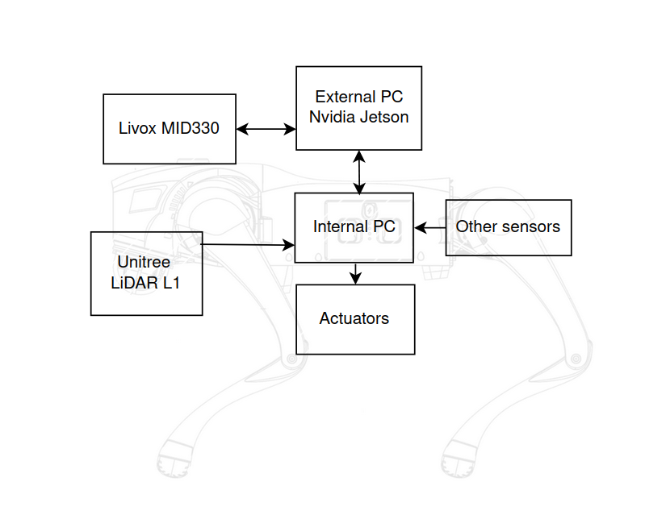

# Frontier-Based SLAM System for a Quadruped Robot

### Bachelor's Thesis Project — Scuola Superiore Sant’Anna  
**Supervisors:** Prof. C.A. Avizzano, Prof. M. Cococcioni  
**Research conducted at:** PERCRO Laboratory, Scuola Superiore Sant’Anna

---

## Project Overview

This project presents the development of a **frontier-based SLAM and autonomous exploration system** for a **Unitree Go2 EDU quadruped robot** ([Unitree Go2 EDU Documentation](https://support.unitree.com/home/en/developer/about_Go2)).  
The work integrates **SLAM, navigation, and exploration** into a single ROS2-based pipeline deployed on an **NVIDIA Jetson platform** running **Ubuntu 20.04** with **ROS2 Foxy**.

The system enables the robot to **map, localize, navigate, and autonomously explore unknown environments** using LiDAR perception and frontier-based decision-making.

---

## System Architecture

### Hardware Architecture
- **Robot:** Unitree Go2 EDU  
- **Onboard computer:** NVIDIA Jetson (Ubuntu 20.04, ROS2 Foxy)  
- **Sensor:** Livox Mid-360 LiDAR  

### Software Architecture
- **SLAM Module:** Precompiled adaptation of [LIO-SAM](https://github.com/TixiaoShan/LIO-SAM) for Livox Mid-360 and Jetson  
- **Navigation Stack:** Configured [Nav2](https://navigation.ros.org/) system  
- **Exploration:** Two custom Python ROS2 nodes implementing frontier-based exploration logic  
- **Map Projection:** Custom C++ node converting 3D LiDAR map to a 2D occupancy grid  
- **Communication Framework:** ROS2 Foxy middleware  
- **Operating System:** Ubuntu 20.04 (JetPack SDK for Jetson)




---

## 🧪 General Setup Instructions

The following setup procedure is the same **for both simulation and real-robot testing**.

### 1. Clone the repository

```bash
git clone <repo_url>
cd exploration_go2
```

### 2. Build the Docker image

```bash
docker build -t exploration_go2 .
```

### 3. Run the Docker container

```bash
./run.sh
```

### 4. Update configuration inside the container

Once inside the running container:

```bash
bash share/update_conf.sh
```

### 5. Build the ROS2 workspace

```bash
cd ros2_ws
colcon build
source install/setup.bash
```

After completing these steps, you can proceed either with **simulation testing** or **real robot deployment**.

---

## Simulation Testing (Gazebo Environment)

In simulation, **Gazebo** was used with a **TurtleBot3 model equipped with a 2D LaserScan sensor**.
This configuration was chosen for its **simplicity, repeatability, and ease of setup**, allowing numerous controlled experiments.
A virtual model of the quadruped was not used, as it would require proprietary motion control firmware or adaptation of open-source models not fully compatible with the Unitree robot.
Such an effort would have introduced additional complexity without significant benefits for evaluating the exploration algorithm.

The goal of simulation was to study the **behavior of the frontier-based exploration strategy**, which can be analyzed largely independently of the robot’s locomotion system.
Both TurtleBot3 and the quadruped share a **planar navigation model**, moving in a 2D space controlled by **linear and angular velocity commands (Twist)**.
Kinematic differences, such as limited omnidirectional capability of the quadruped, were neglected as they have minimal impact on the evaluation of exploration algorithms.

---

### Launch Instructions

Inside the Docker container, after building the workspace:

#### 1. Start Gazebo simulation

```bash
ros2 launch turtlebot3_gazebo turtlebot3_world.launch.py
```

#### 2. Launch SLAM

```bash
ros2 launch slam_toolbox online_async_launch.py use_sim_time:=true
```

#### 3. Launch Navigation (Nav2)

```bash
ros2 launch nav2_bringup bringup_launch.py use_sim_time:=true
```

#### 4. Start RViz visualization

```bash
rviz2 -d /home/share/planning.rviz
```

#### 5. Launch the exploration node

```bash
ros2 launch exploration_pkg explorer.launch.py
```

Once all components are running, the TurtleBot3 will autonomously explore the simulated environment, mapping it through SLAM and using Nav2 for motion planning.

---

## Real Robot Deployment (Unitree Go2)

For real-world deployment, follow the official Unitree ROS2 setup guidelines:

* [Unitree ROS2 Service Guide](https://support.unitree.com/home/en/developer/ROS2_service)
* [Unitree Module Update Instructions](https://support.unitree.com/home/en/developer/module_update)

Download the ZIP package containing the official modules for the Jetson system.
The **SLAM module** provided by Unitree works correctly on Jetson, while the **navigation module** lacks obstacle avoidance.
For this reason, a **custom Nav2 configuration** was used instead.

---

### Launch Instructions


#### 1. Run the official Unitree SLAM module

Follow the steps described in the [SLAM and Navigation Service documentation](https://support.unitree.com/home/en/developer/SLAM%20and%20Navigation_service).

#### 2. Launch the node that gives twist command to robot API

```bash
ros2 run exploration_pkg cmd_vel_bridge
```
#### 3. Launch the 3D→2D map projection node

```bash
ros2 run exploration_pkg map_projector_bayesian
```


#### 4. Launch the TF publisher for L1 tranform

```bash
python3 tfl1.py --x 0.2 --alpha 167
```

#### 5. Launch Navigation (Nav2)

```bash
ros2 launch nav2_bringup bringup.launch.py
```

#### 6. Start RViz2 visualization

```bash
rviz2
```

At this point, it is possible to verify that the **SLAM + Navigation** stack is functioning correctly by manually sending goals via RViz2.

If the robot successfully follows navigation goals and the occupancy grid updates as expected, the **exploration module** can be launched.

#### 7. Launch autonomous exploration

```bash
ros2 launch exploration_pkg explorer.launch.py
```

The robot will then autonomously explore the environment using the frontier-based goal selection algorithm, integrated with SLAM and Nav2.

---
